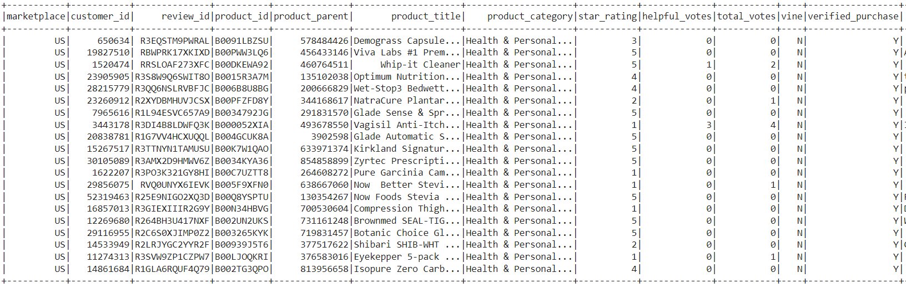
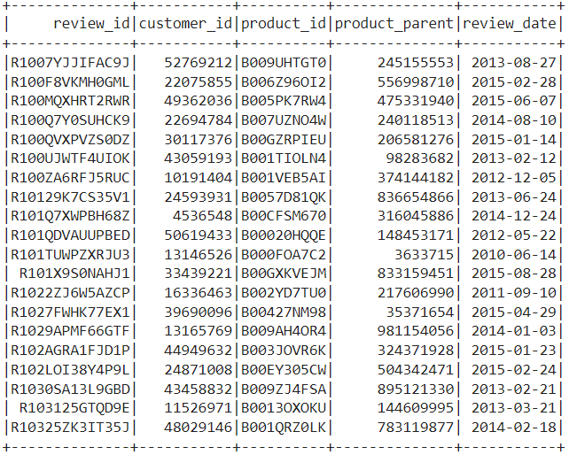
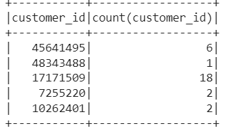
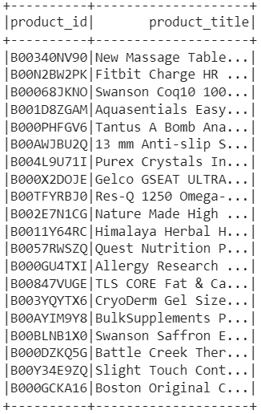
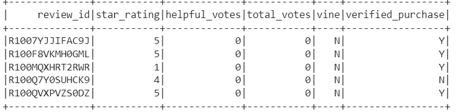
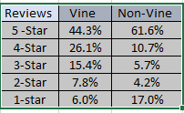
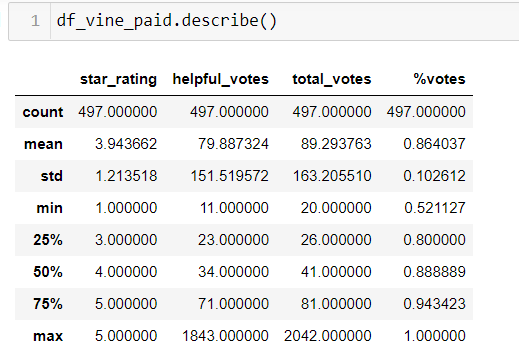
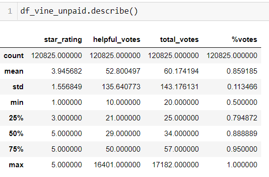
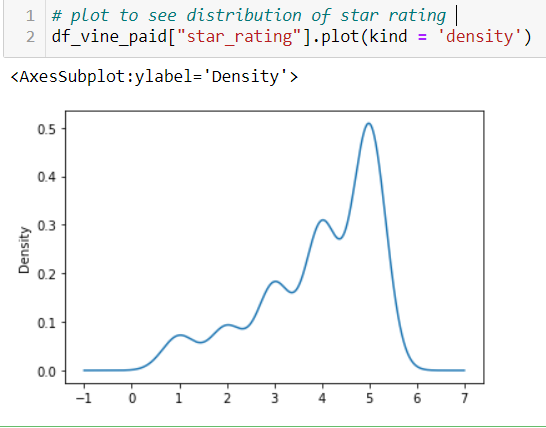
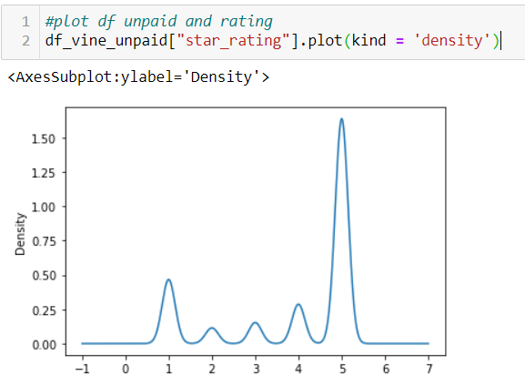

# Analysing Amazon reviews written by members of the paid Amazon Vine program

**Overview of the analysis:**

The Amazon Vine program is a service that allows manufacturers and publishers to receive reviews for their products. Companies like Selby pay a small fee to Amazon and provide products to Amazon Vine members, who are then required to publish a review. Amazon vine program was created to provide customers with more information including honest and unbiased feedback from some of Amazon's most trusted reviewers. 

In this analysis I choose the dataset for Health & Personal products in Amazon and analyzed their reviews, The purpose of the analysis is to determine if there is any bias toward favorable reviews from Vine members in the dataset.

I have used PySpark to perform the ETL process to extract the dataset, transform the data, connect to an AWS RDS instance, and load the transformed data into pgAdmin. I have also used Pandas to analyze and determine if there is any bias toward favorable reviews from Vine members in your dataset.

Data extracted from Amazon S3:

Created four tables to load the data into Pgadmin

**Results:**

[1] Total Vine program review in the dataset is 497, Total non-vine dataset 120825.

[2] 220 Vine reviews are 5 star and 74445 non-vine reviews are 5star reviews

[3] Percentage of Vine reviews that are 5 star is 0.44 that is 44% out of 497 total vine reviews, compared to the non-vine reviews that is 0.61 (61%). The paid program’s five star review percentage is less compared to unpaid program's five star review, although the total paid (497) and unpaid (120825) are different in size, I have also analyzed all other stars ,to make sure if there is any bias, from the display above , I could say there is no noticeable bias between paid and unpaid reviews , However one could say there are very less 1 star reviews in Vine program compared to non-Vine. 

**Summary:**

Mean for the paid data and the unpaid data is 3.94, I would say the reviews are unbiased and the paid program is not reviews driven, to support my results please see the chart and statistics below, The distribution of review both paid and nonpaid programs do not show any bias as well.

